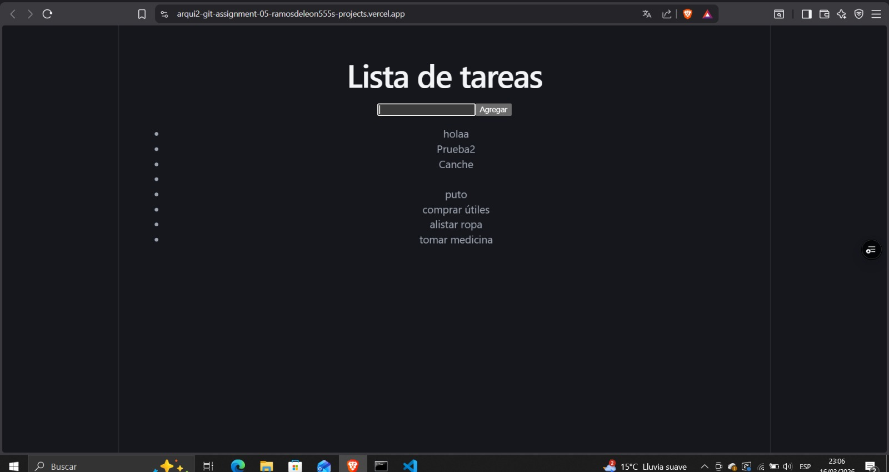
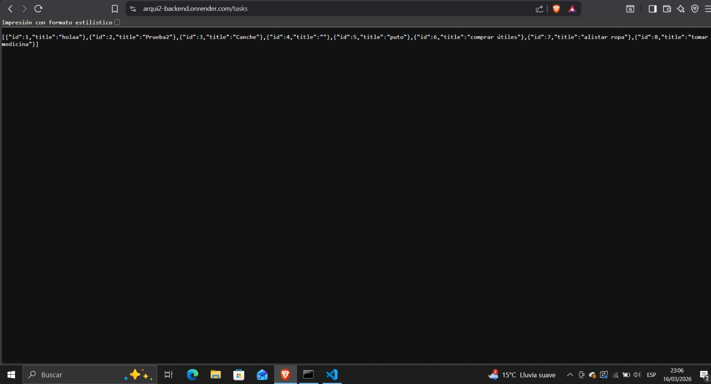
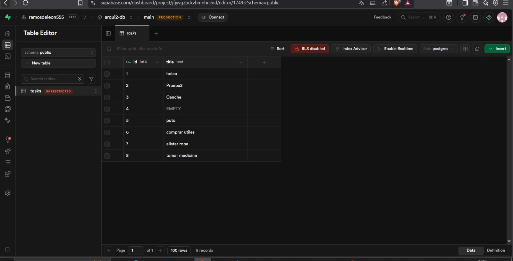

# Proyecto Lista de Tareas

## Enlaces

Frontend:
[[https://TU-FRONTEND.vercel.app](https://arqui2-git-assignment-05-ramosdeleon555s-projects.vercel.app/)]([https://TU-FRONTEND.vercel.app](https://arqui2-git-assignment-05-ramosdeleon555s-projects.vercel.app/))

Backend:
[https://arqui2-backend.onrender.com/tasks]([https://arqui2-backend.onrender.com/tasks](https://arqui2-backend.onrender.com/tasks))

---

## Evidencias

### Frontend

---

### Backend

---

### Base de Datos

---

## Base de Datos

Tabla: `tasks`

- id
- title

---

## Funcionalidades

- Crear tareas
- Listar tareas

---

## Autor

Daniel Ramos 202308085
