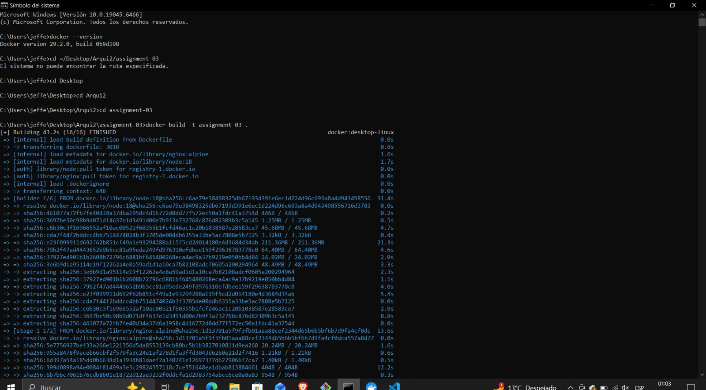
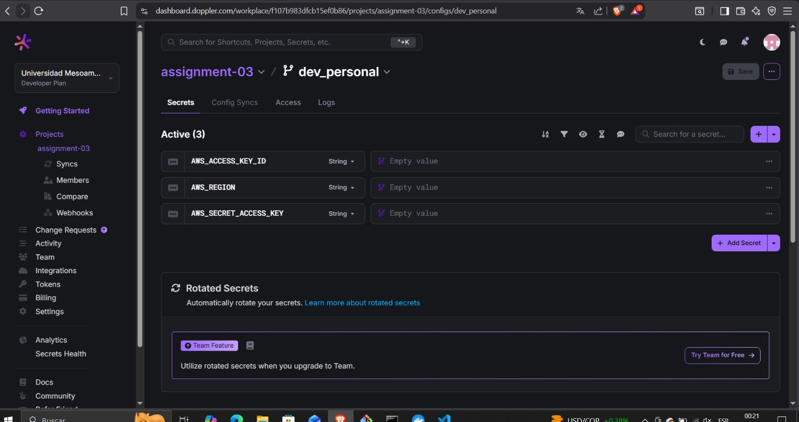
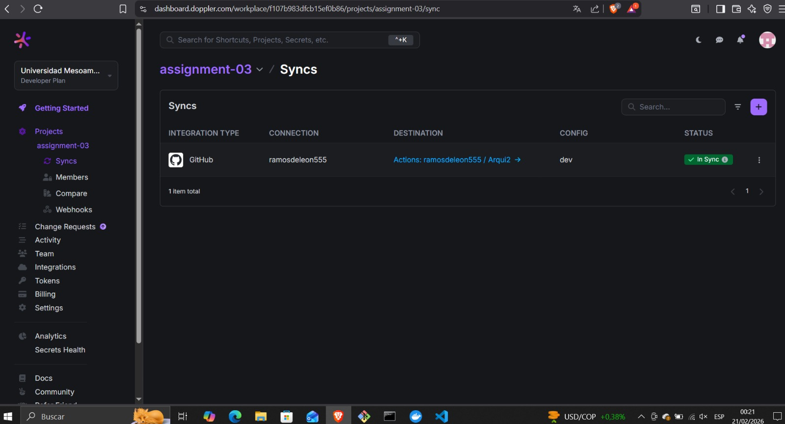
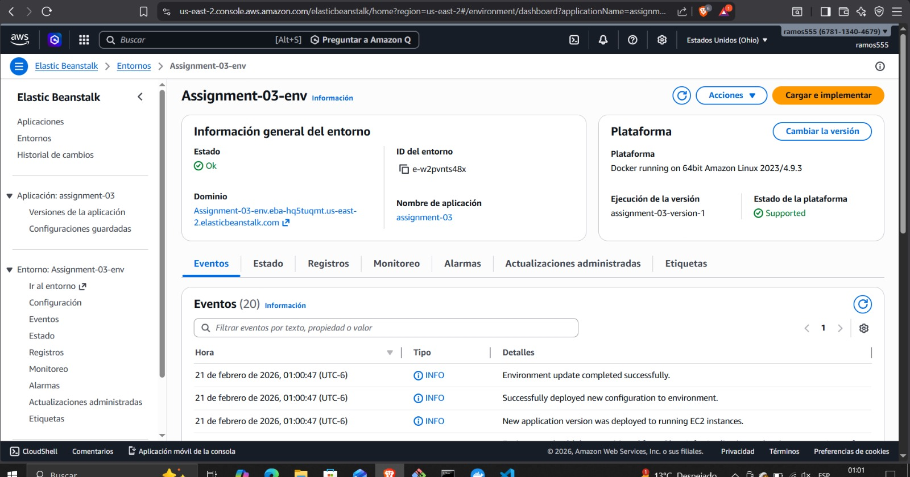
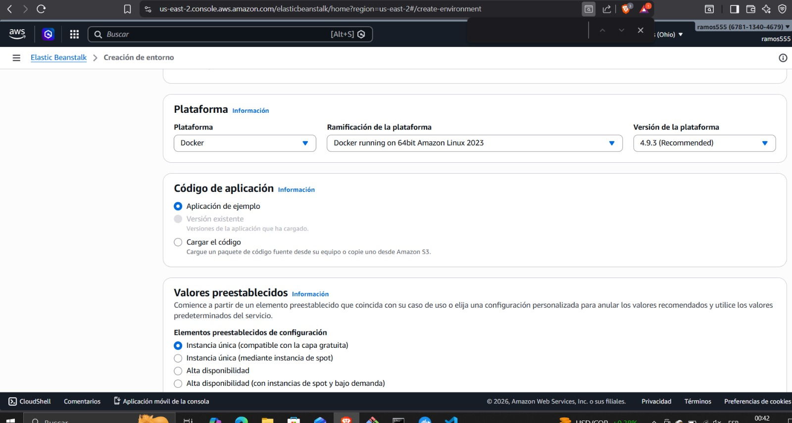
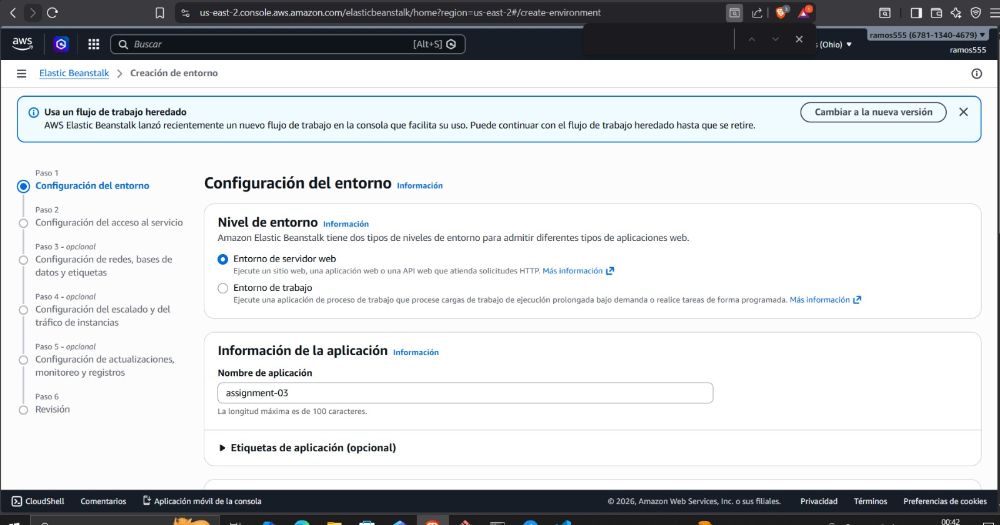
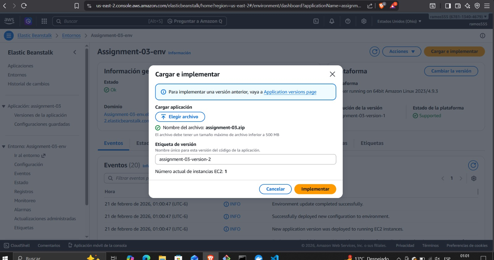
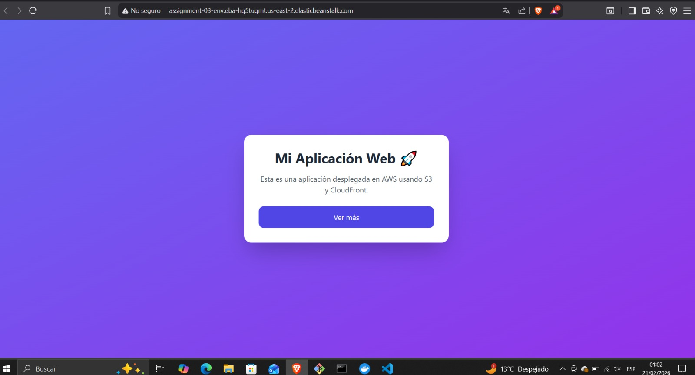

# Assignment 03 - Arquitectura de Sistemas II

http://assignment-03-env.eba-hq5tuqmt.us-east-2.elasticbeanstalk.com/

##  Descripción

Este proyecto consiste en la implementación y despliegue de una aplicación web utilizando:

- Vite
- Docker
- Husky
- GitHub Actions
- AWS Elastic Beanstalk
- Doppler

---

##  Docker

Se creó un Dockerfile multi-stage para:

1. Construir la aplicación con Node
2. Servirla con Nginx

### Imagen construida localmente


---

## Doppler

Se configuró para la gestión de variables de entorno y sincronización con GitHub.




---

## Despliegue en AWS Elastic Beanstalk

La aplicación fue desplegada en AWS Elastic Beanstalk. Primeramente debemos ingresar con nuestras credenciales a AWS, luego en la búsqueda ingresamos Elastic Beanstalk y damos clic.
Después, creamos nuestro entorno dando clic en Siguiente, y nos debe aparecer algo como esto: 


Damos clic en el botón amarillo de Cargar e Implementar


Se nos abre la configuración del entorno. Damos en entorno de servidor web, y le ponemos un nombre a la aplicación. Damos clic en Siguiente. Abrimos en la URL brindada y debe decir algo relacionado a AWS Elastic Beanstalk.


Terminamos el proceso, y luego en cargar e implementar nuevamente y ahora si subimos lo que ya tenemos en el proyecto.


---

##  Husky (Pre-commit Hook)

Se configuró Husky para ejecutar:

---

## Vista de la app 



```bash
npm run build


